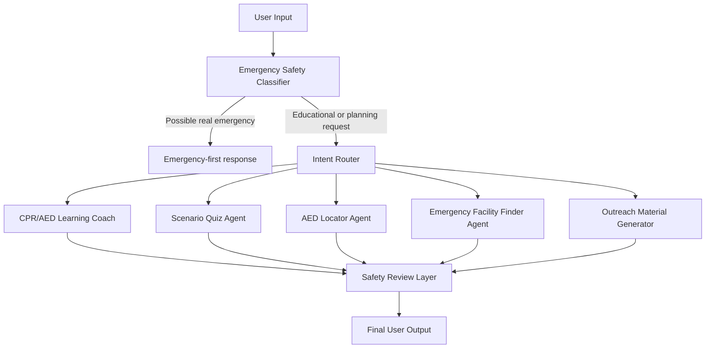

# PulsePrep Agent: CPR/AED Readiness for Communities

PulsePrep Agent is a community emergency-readiness assistant for CPR/AED education. It helps users learn CPR/AED basics, practice emergency scenarios, create outreach materials, and explore AED / emergency facility preparedness maps.

> **Important:** PulsePrep is an educational prototype. It does not replace 911/emergency services, certified CPR/AED training, EMS, clinicians, school nurses, athletic trainers, or emergency dispatchers.

## Track

Kaggle Capstone Track: **Agents for Good**

## Main Features

- Emergency safety classifier
- CPR/AED learning coach
- Scenario-based practice quiz
- AED locator / AED awareness helper using optional Google Places lookup or fallback planning data
- Emergency facility awareness finder using optional Google Places lookup or fallback planning data
- Community outreach material generator
- Safety review layer
- MCP-style tool server for agent tools

## Architecture



## Safety Design

PulsePrep places safety checks at the beginning and end of the workflow.

1. **Emergency Safety Classifier:** detects possible emergency language and immediately returns an emergency-first response.
2. **Safety Review Agent:** reviews generated content to add missing emergency-service language, remove unsafe phrasing, and add location verification warnings.

For real emergencies, the app prioritizes:

- Call emergency services immediately.
- Send someone to get the AED.
- Follow dispatcher instructions.
- Begin CPR if trained and safe.
- Turn on the AED and follow its voice prompts.

## Setup

### 1. Clone the repository

```bash
git clone <YOUR_REPO_URL>
cd pulseprep-agent
```

### 2. Create a virtual environment

```bash
python -m venv .venv
source .venv/bin/activate
```

On Windows:

```bash
.venv\Scripts\activate
```

### 3. Install dependencies

```bash
pip install -r requirements.txt
```

### 4. Run the app

```bash
streamlit run app.py
```

## Optional MCP Server

PulsePrep includes an MCP-style tool server in `mcp_server.py`. The app does not require it to run, but it demonstrates the project’s tool interface.

To try the optional FastMCP version:

```bash
pip install -r requirements-mcp.txt
python mcp_server.py
```

If the `mcp` package is not installed, `mcp_server.py` automatically falls back to a simple JSON-lines tool server that reads one JSON object per line from standard input.

Example fallback call:

```bash
echo '{"tool":"classify_emergency_intent","args":{"message":"Someone collapsed and is not breathing"}}' | python mcp_server.py
```

## Project Structure

```text
pulseprep-agent/
├── app.py
├── config.py
├── mcp_server.py
├── requirements.txt
├── requirements-mcp.txt
├── .env.example
├── .gitignore
├── agents/
│   ├── emergency_classifier.py
│   ├── router.py
│   ├── cpr_aed_coach.py
│   ├── scenario_quiz_agent.py
│   ├── aed_locator_agent.py
│   ├── emergency_facility_agent.py
│   ├── outreach_agent.py
│   └── safety_review_agent.py
├── tools/
│   ├── safety_tools.py
│   ├── quiz_tools.py
│   ├── google_places_tools.py
│   ├── location_tools.py
│   └── outreach_tools.py
├── data/
│   ├── aed_locations_sample.csv
│   └── emergency_facilities_sample.csv
├── examples/
│   └── sample_prompts.md
├── diagrams/
│   └── architecture.mmd
└── tests/
    └── test_safety.py
```

## Demo Notes

Set `GOOGLE_MAPS_API_KEY` locally to enable live Google Places lookup for map-related planning demos. If it is not configured, PulsePrep uses fallback planning data from the included CSV files.

AED awareness results are candidate places to contact or verify, not confirmed AED locations. Confirm AED presence, access, signage, maintenance status, and hours with the facility.

Emergency facility results are for preparedness planning only. They do not replace 911, emergency dispatch, ambulance routing, medical triage, EMS, clinicians, CPR/AED certification, or local emergency instructions. In a real emergency, call 911 or local emergency services first and follow dispatcher instructions.

## Suggested Kaggle Video Demo

A 5-minute demo can show:

1. Emergency safety classifier.
2. CPR/AED learning coach.
3. Scenario-based quiz and feedback.
4. AED locator / awareness map with live lookup when configured or fallback planning data.
5. Emergency facility awareness finder with safety warning.
6. Community outreach generator.

## No Secrets Policy

Do not commit API keys or private information. Use `.env` locally and commit only `.env.example`.
