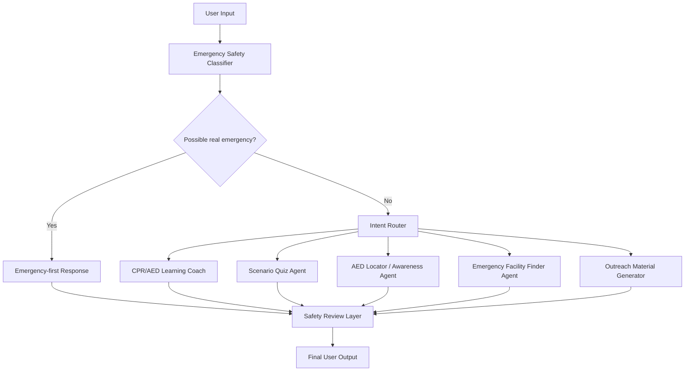

# PulsePrep Agent: CPR/AED Readiness for Communities

PulsePrep Agent is a community emergency-readiness assistant for CPR/AED education. It helps users learn CPR/AED basics, practice emergency scenarios, create outreach materials, and explore AED / emergency facility preparedness planning.

> **Important:** PulsePrep is an educational prototype. It does **not** replace 911/emergency services, certified CPR/AED training, EMS, clinicians, school nurses, athletic trainers, or emergency dispatchers.

## Track

**Kaggle Capstone Track:** Agents for Good

PulsePrep fits the Agents for Good track because it supports public health education, emergency preparedness, and community safety awareness.

---

## Main Features

- Emergency safety classifier
- CPR/AED learning coach
- Scenario-based practice quiz
- AED locator / AED awareness helper using optional Google Places lookup or fallback planning data
- Emergency facility awareness finder using optional Google Places lookup or fallback planning data
- Community outreach material generator
- Safety review layer
- MCP-style tool server for agent tools

---

## The Problem

Many people know CPR and AEDs are important, but they may not feel prepared to act quickly in a real emergency. In schools, sports practices, workplaces, and community events, people may hesitate because they do not know what to do first, where an AED might be located, or whether an AED is safe to use.

PulsePrep helps communities prepare **before** an emergency happens.

---

## The Solution

PulsePrep provides a structured CPR/AED readiness assistant that can:

1. Detect possible real emergency language and respond with emergency-first guidance.
2. Explain CPR/AED concepts in age-appropriate language.
3. Create realistic practice scenarios.
4. Help communities plan AED awareness materials.
5. Support emergency facility awareness planning.
6. Generate outreach materials such as announcements, posters, and reminders.
7. Add safety limitations and verification reminders before final output.

---

## Why Agents?

CPR/AED readiness requires more than answering one question. The system must first detect whether the user may be describing a real emergency. If so, it must immediately prioritize calling emergency services.

If the request is educational or planning-oriented, the system routes the user to the correct specialized agent:

- CPR/AED Learning Coach
- Scenario Quiz Agent
- AED Locator / Awareness Agent
- Emergency Facility Finder Agent
- Community Outreach Agent

This makes the project more than a basic chatbot. It is an agent-style system with classification, routing, tool use, and safety review.

---

## Architecture

PulsePrep uses a multi-agent workflow:



---

## Screenshots

### 1. Emergency Safety Classifier

PulsePrep detects possible real-emergency language and prioritizes emergency-first guidance.


### 2. AED Learning Coach

PulsePrep explains AED concepts in age-appropriate language for a middle school audience.


### 3. Scenario Practice Quiz

PulsePrep creates an interactive emergency scenario and gives feedback on key CPR/AED readiness steps.


### 4. AED Locator / Awareness Demo

PulsePrep supports AED awareness planning using candidate locations and local verification reminders.


### 5. Emergency Facility Finder Demo

PulsePrep supports emergency facility awareness planning with strong safety limitations.


### 6. Outreach Generator

PulsePrep creates community outreach materials such as school announcements, posters, and AED awareness reminders.


### 7. About / Project Overview

The About page explains the project purpose, agent architecture, tool layer, and safety limitations.


---

## Safety Design

PulsePrep places safety checks at the beginning and end of the workflow.

### Emergency Safety Classifier

The emergency safety classifier detects possible real emergency language and immediately returns an emergency-first response.

For possible real emergencies, PulsePrep prioritizes:

1. Call 911 or local emergency services immediately.
2. Send someone to get the nearest AED.
3. Follow dispatcher instructions.
4. Begin CPR if trained and safe.
5. Turn on the AED and follow its voice prompts.

### Safety Review Agent

The safety review layer checks generated content before final output. It adds emergency-service reminders, educational limitations, and location verification warnings when needed.

### AED and Facility Location Safety

AED and emergency facility planning features are for preparedness only.

AED awareness results are candidate places to contact or verify, not confirmed AED locations. Users must confirm AED presence, access, signage, maintenance status, and hours with the facility.

Emergency facility results do not replace 911, emergency dispatch, ambulance routing, medical triage, EMS, clinicians, CPR/AED certification, or local emergency instructions.

---

## Technology Stack

- Python
- Streamlit
- Modular agent architecture
- Rule-based emergency safety classifier
- Intent router
- MCP-style tool server
- Google Places lookup support through `GOOGLE_MAPS_API_KEY`
- CSV fallback planning data
- Pytest test suite
- Mermaid architecture diagram

---

## Setup

### 1. Clone the repository

```bash
git clone https://github.com/MR-TIGER-PIXEL/pulseprep-agent.git
cd pulseprep-agent
```

### 2. Create a virtual environment

```bash
python -m venv .venv
source .venv/bin/activate
```

On Windows:

```bash
.venv\Scripts\activate
```

### 3. Install dependencies

```bash
pip install -r requirements.txt
```

### 4. Run the app

```bash
streamlit run app.py
```

Then open the local Streamlit URL shown in the terminal.

Usually:

```text
http://localhost:8501
```

---

## Optional Google Places Lookup

PulsePrep can use Google Places lookup for map-related planning demos when configured with an API key.

Set the key locally:

```bash
export GOOGLE_MAPS_API_KEY="your_google_maps_api_key"
streamlit run app.py
```

Or add it to a local `.env` file:

```text
GOOGLE_MAPS_API_KEY=your_google_maps_api_key
```

Do **not** commit `.env` or any API keys to GitHub.

If `GOOGLE_MAPS_API_KEY` is not configured, PulsePrep uses fallback planning data from the included CSV files.

---

## Optional MCP Server

PulsePrep includes an MCP-style tool server in `mcp_server.py`. The Streamlit app does not require it to run, but it demonstrates the project’s tool interface.

To try the optional MCP version:

```bash
pip install -r requirements-mcp.txt
python mcp_server.py
```

If the MCP package is not installed, `mcp_server.py` falls back to a simple JSON-lines tool server that reads one JSON object per line from standard input.

Example fallback call:

```bash
echo '{"tool":"classify_emergency_intent","args":{"message":"Someone collapsed and is not breathing"}}' | python mcp_server.py
```

---

## Testing

Run the test suite:

```bash
python -m pytest -q
```

The final tested version passed:

```text
12 passed
```

The tests check emergency routing, planning/outreach routing, safety reminders, fallback planning data behavior, and map-related safety disclaimers.

---

## Demo Prompts

### Demo 1 — Emergency Safety Classifier

```text
Someone collapsed at basketball practice and is not breathing. What should I do?
```

Expected behavior: emergency-first response with 911/local emergency number, AED retrieval, dispatcher instructions, CPR if trained and safe, and AED voice prompts.

### Demo 2 — AED Learning Coach

```text
Explain what an AED does for a middle school student.
```

Expected behavior: student-friendly AED explanation with safety reminders.

### Demo 3 — Scenario Practice Quiz

Use the **Scenario Practice Quiz** mode.

Example answer:

```text
I would call 911, tell a coach or adult to get the AED, start CPR if trained and safe, and follow the AED voice prompts when it arrives.
```

Expected behavior: the quiz feedback should detect key steps such as calling emergency services, getting the AED, starting CPR if trained and safe, and following AED prompts.

### Demo 4 — AED Locator / Awareness Demo

Use the **AED Locator / Awareness Demo** tab.

Expected behavior: candidate AED-awareness planning locations, local verification reminders, and safety limitations.

### Demo 5 — Emergency Facility Finder Demo

Use the **Emergency Facility Finder Demo** tab.

Expected behavior: emergency facility planning results with 911, dispatch, ambulance routing, and triage disclaimers.

### Demo 6 — Outreach Generator

Use the **Outreach Generator** tab.

Example:

```text
Create a short AED awareness announcement for students and staff about AEDs near the gym and main office.
```

Expected behavior: a school-friendly announcement, poster, or reminder with AED awareness and emergency-service language.

---

## Project Structure

```text
pulseprep-agent/
├── app.py
├── config.py
├── mcp_server.py
├── requirements.txt
├── requirements-mcp.txt
├── .env.example
├── .gitignore
├── README.md
├── TESTING.md
├── agents/
│   ├── emergency_classifier.py
│   ├── router.py
│   ├── cpr_aed_coach.py
│   ├── scenario_quiz_agent.py
│   ├── aed_locator_agent.py
│   ├── emergency_facility_agent.py
│   ├── outreach_agent.py
│   └── safety_review_agent.py
├── tools/
│   ├── safety_tools.py
│   ├── quiz_tools.py
│   ├── google_places_tools.py
│   ├── location_tools.py
│   └── outreach_tools.py
├── data/
│   ├── aed_locations_sample.csv
│   └── emergency_facilities_sample.csv
├── examples/
│   └── sample_prompts.md
├── diagrams/
│   └── architecture.mmd
├── media/
│   └── screenshots/
└── tests/
    └── test_safety.py
```

---

## Limitations

PulsePrep is not a medical device, emergency dispatch tool, ambulance routing system, or clinical decision system.

It does not replace:

- 911 or local emergency services
- Emergency dispatchers
- EMS
- Clinicians
- School nurses
- Athletic trainers
- Certified CPR/AED training
- Local emergency action plans

AED and emergency facility information must be verified locally before use in real preparedness plans.

---

## No Secrets Policy

Do not commit API keys, passwords, tokens, or private information.

Use `.env` locally, but commit only `.env.example`.

---

## License

This project is a capstone educational prototype for CPR/AED readiness and AI agent system design.
