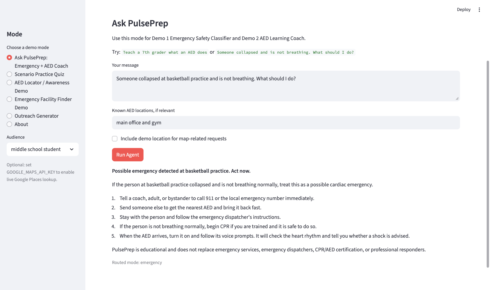
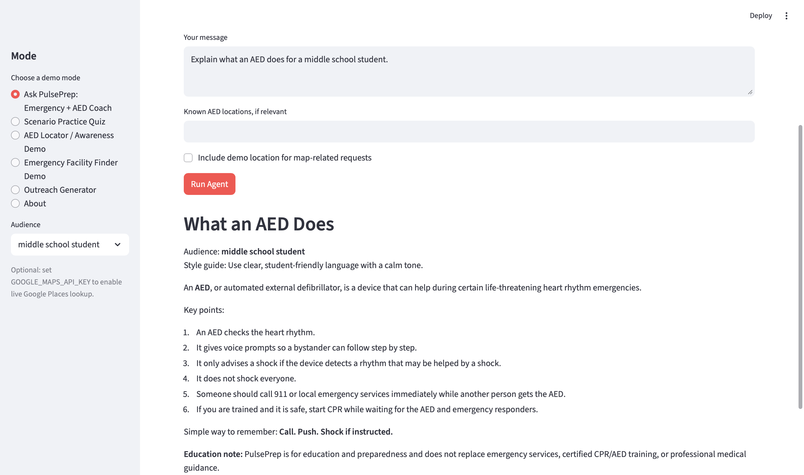
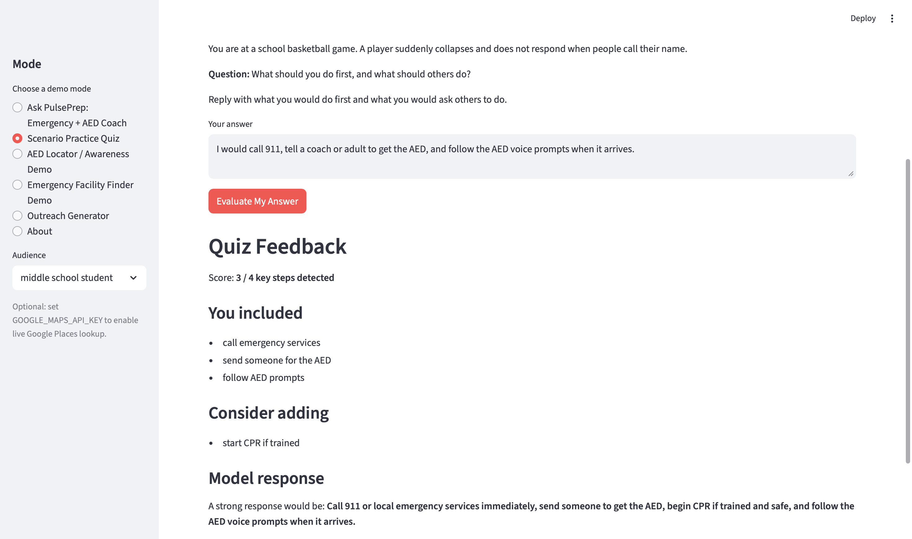
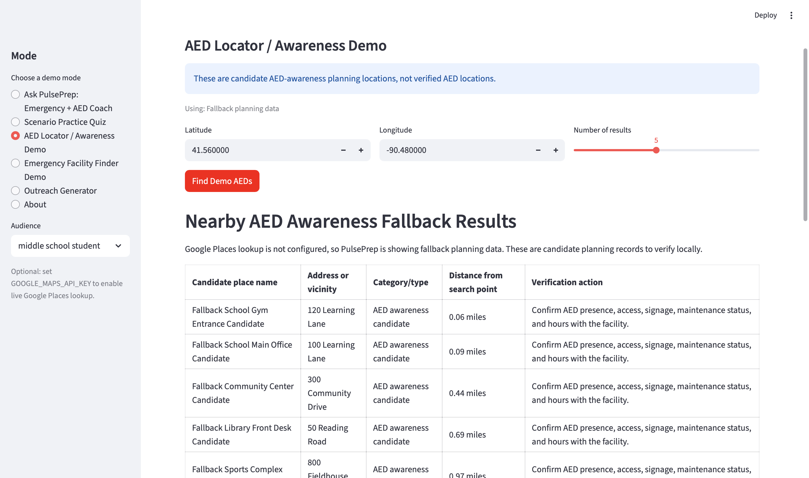
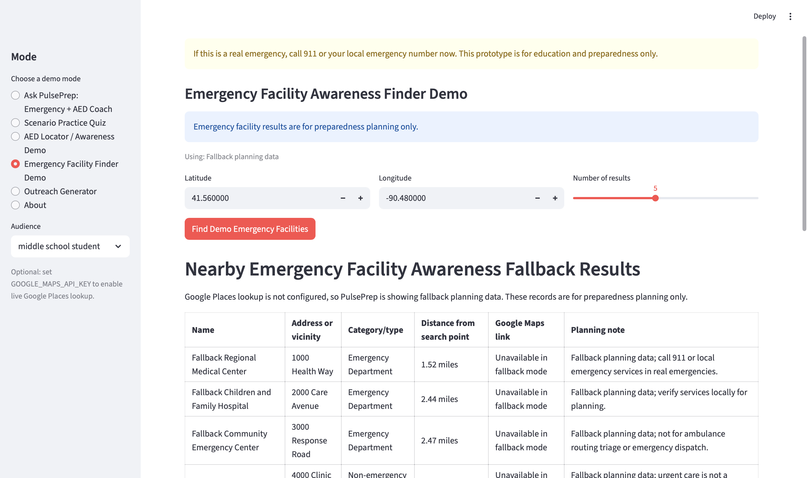
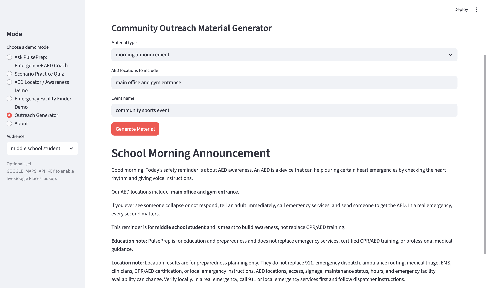
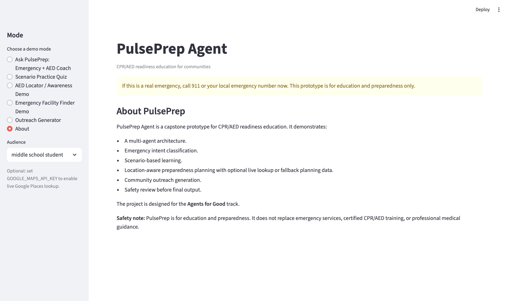

## Screenshots

### 1. Emergency Safety Classifier
PulsePrep detects possible real-emergency language and prioritizes emergency-first guidance.

### 2. AED Learning Coach
PulsePrep explains AED concepts in age-appropriate language for a middle school audience.

### 3. Scenario Practice Quiz
PulsePrep creates an interactive emergency scenario and gives feedback on key CPR/AED readiness steps.

### 4. AED Locator / Awareness Demo
PulsePrep supports AED awareness planning using candidate locations and local verification reminders.

### 5. Emergency Facility Finder Demo
PulsePrep supports emergency facility awareness planning with strong safety limitations.

### 6. Outreach Generator
PulsePrep creates community outreach materials such as school announcements, posters, and AED awareness reminders.

### 7. About / Project Overview
The About page explains the project purpose, agent architecture, tool layer, and safety limitations.

